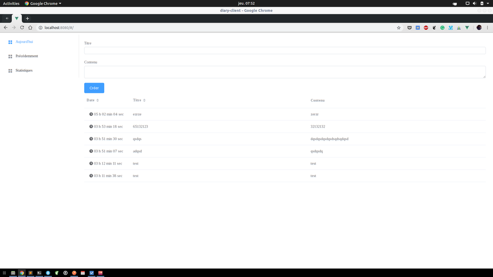
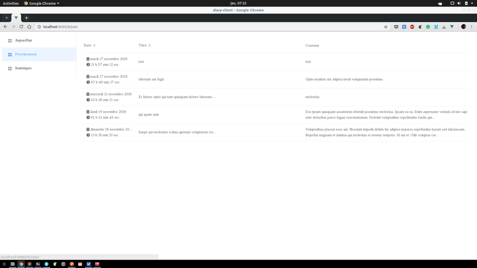
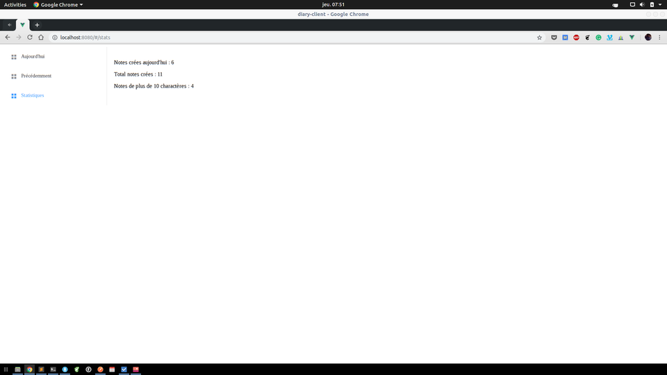

  

# Diary app 

## Purpose 

The goal of this app is just for me to learn how vuejs works with an api.
This is a simple app, where you can manages notes and have some stats about them (nothing usefull for the moment).

## How to get started

### Prerequisites
- a mongodb server running
- nodejs (v11)

### How to test it
- Install vue-cli to lauch the client app
    + `npm install -g @vue/cli`
- (Optional) Create the fixtures `node api/fixtures/fixturesNotes.js`
- Launch the api and the client app(in different terminals)
    + the api: `cd ./api && npm start`
    + the client app: `cd ./client-app && npm run serve`

### screenshots

